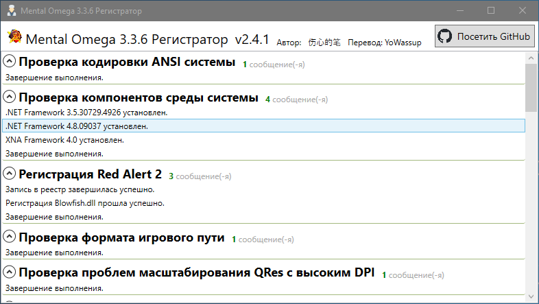

# Mental Omega Регистратор 

Автоматизированный инструмент для настройки и диагностики игрового окружения, входящий в состав Mental Omega Integration Pack. Может быть адаптирован для других игровых модов Red Alert 2 / Ares / Phobos, также основанных на [xna-cncnet-client](https://github.com/CnCNet/xna-cncnet-client/).

## Лицензионное соглашение

Этот проект имеет открытый исходный код под лицензией GPL v3.0. Вкратце: информация об авторе не может быть удалена, производные работы должны быть открыты под той же лицензией, и автор не несет ответственности. Приведенные выше утверждения предназначены только для облегчения понимания и основаны на [полном тексте соглашения](./LICENSE).

## Локализация

[Оригинальная работа](https://github.com/SadPencil/Mo3RegUI) за авторством SadPencil (伤心的笔), перевод на русский YoWassup.

